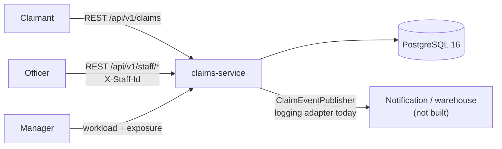
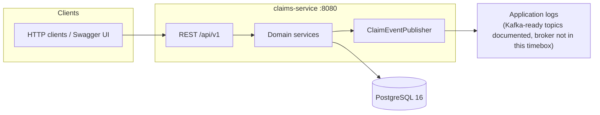
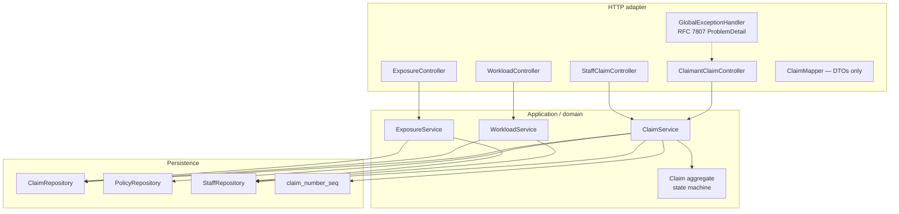
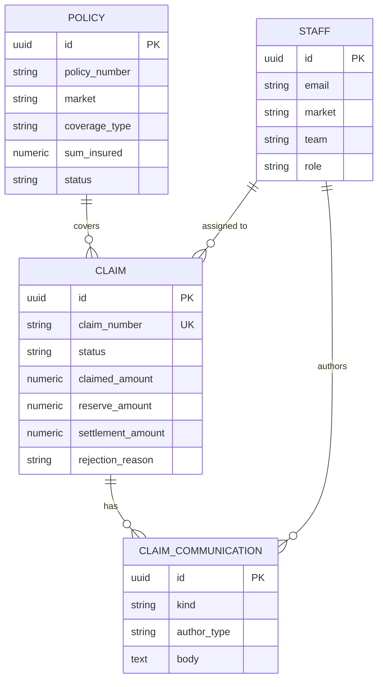
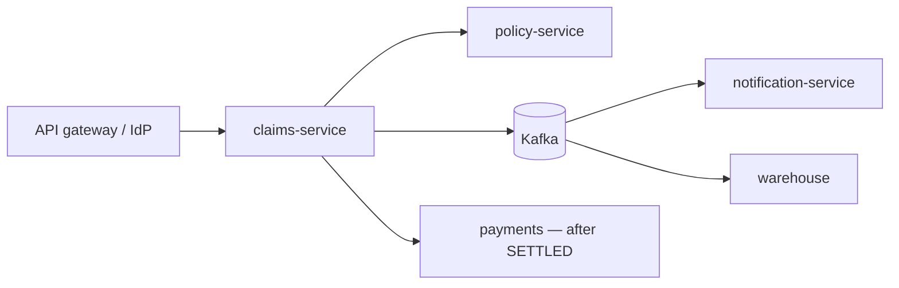

# Architecture

This service is the backend for Chubb APAC motor and property claims: intake, lifecycle, staff workload, and outstanding liability. Frontend is out of scope.

## Context



**Why one service:** a 2–3 hour slice needs one transactional boundary for “create claim + default reserve + event”. Package boundaries (`policy`, `staff`, `claim`, `workload`, `exposure`) are the internal seams. A production landscape would split Policy, Identity, Notification, and Payments.

## Containers (runtime)



| Concern | Choice |
|---|---|
| Sync user waits | REST (submit, track, assign, decide, workload, exposure) |
| Async side effects | `ClaimEventPublisher` port; `LoggingClaimEventPublisher` bean |
| Schema | Flyway only; JPA `ddl-auto: validate`; `open-in-view: false` |
| Auth (assessment) | Claimant: knowledge of `claimNumber`. Staff: `X-Staff-Id` matching an active `staff` row |

Intended Kafka topics (not implemented): `chubb.claims.claim-submitted.v1`, `…assigned.v1`, `…information-requested.v1`, `…information-provided.v1`, `…decided.v1`. Key: `claimNumber`.

## Components (inside the jar)



Layering rules:

- Controllers map HTTP ↔ commands/DTOs. No state-machine `if` in controllers.
- JPA entities never leave the service layer.
- Transitions live on `Claim` (`open`, `assign`, `requestInformation`, `provideInformation`, `updateReserve`, `settle`, `reject`).
- Illegal transitions and authz become `DomainException` → `urn:chubb:claims:problem:{suffix}`.

## Data model



Invariants are encoded twice: CHECK/UNIQUE/FK in Flyway, and the `Claim` aggregate in Java. Outstanding liability is `SUM(reserve_amount)` where status ∈ {`OPEN`, `IN_PROGRESS`, `PENDING_INFORMATION`}. Terminal claims drop out of exposure; the last reserve is kept for audit.

## Package map

```
com.chubb.claims
  claim/       aggregate, service, REST for lifecycle
  policy/      reference data (seeded; no write API)
  staff/       officers and managers
  workload/    team load + 30-day performance
  exposure/    outstanding reserve rollup
  event/       publisher port
  shared/      DomainException, ProblemDetail
```

## What a later split would look like



Not in this repo: OAuth, document upload, FNOL adapters, payments, outbox, CQRS read models.
