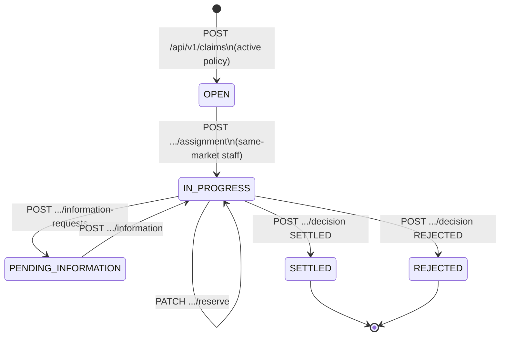
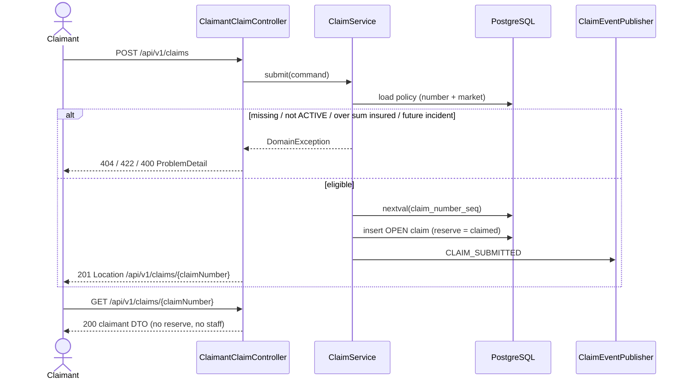
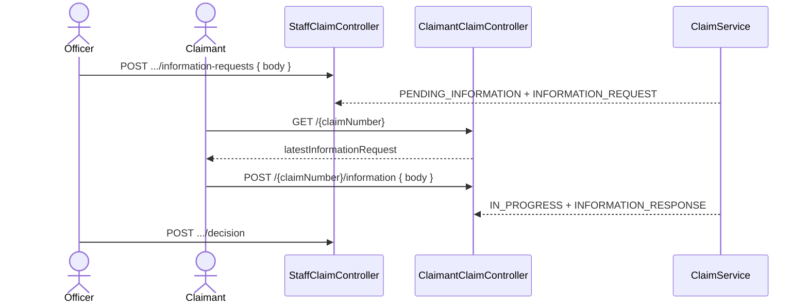
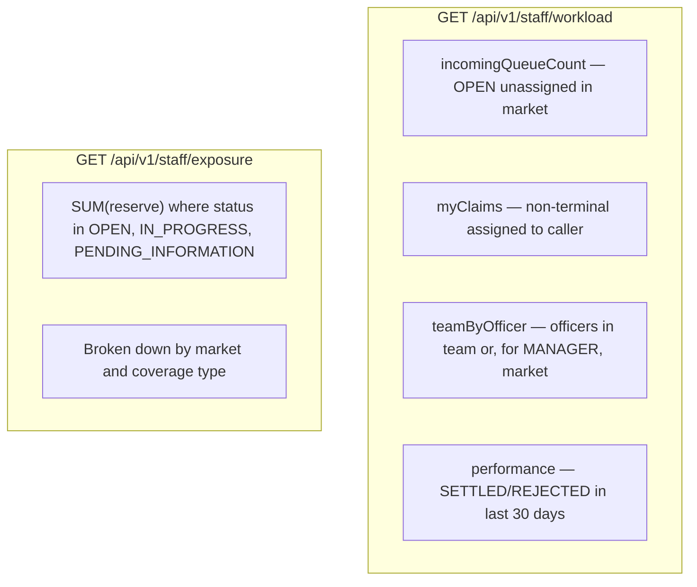
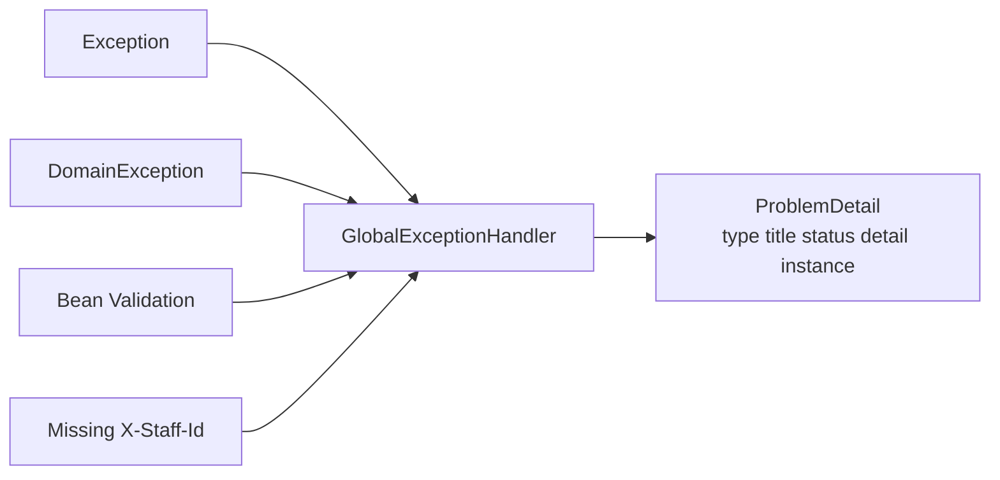

# Flows

Happy paths and the state machine as implemented. APIs are listed at the end.

## Claim lifecycle



| From | Event | To | Actor |
|---|---|---|---|
| — | submit | `OPEN` | claimant |
| `OPEN` | assign | `IN_PROGRESS` | in-market staff |
| `IN_PROGRESS` | request info | `PENDING_INFORMATION` | assignee or in-market manager |
| `PENDING_INFORMATION` | provide info | `IN_PROGRESS` | claimant |
| `IN_PROGRESS` | update reserve | `IN_PROGRESS` | assignee or in-market manager |
| `IN_PROGRESS` | settle | `SETTLED` | assignee or in-market manager |
| `IN_PROGRESS` | reject | `REJECTED` | assignee or in-market manager |

Anything else is `409` (`illegal-claim-state` or `claim-already-assigned`). Writes on terminal claims are `409`. Cross-market staff is `403`. Missing/unknown `X-Staff-Id` on `/api/v1/staff/**` is `401`.

Assign is atomic (`UPDATE … WHERE status = OPEN AND assigned_staff_id IS NULL`) so two officers cannot both pick up the same claim.

## Claimant: report and track



## Staff: pickup, assess, decide

```mermaid
sequenceDiagram
    actor Officer
    participant API as StaffClaimController
    participant Svc as ClaimService
    participant DB as PostgreSQL
    participant Evt as ClaimEventPublisher

    Officer->>API: GET /queue  (X-Staff-Id)
    API-->>Officer: OPEN claims in officer market

    Officer->>API: POST /{claimNumber}/assignment
    API->>Svc: assignToSelf
    Svc->>DB: assignIfOpen
    alt 0 rows
        API-->>Officer: 409 already assigned
    else 1 row
        Svc->>Evt: CLAIM_ASSIGNED
        API-->>Officer: 200 IN_PROGRESS
    end

    Officer->>API: PATCH /{claimNumber}/reserve
    Note over Svc: only IN_PROGRESS; 0 ≤ reserve ≤ sumInsured

    alt settle
        Officer->>API: POST /decision SETTLED
        Svc->>Evt: CLAIM_DECIDED
        API-->>Officer: 200 SETTLED
    else reject
        Officer->>API: POST /decision REJECTED
        Svc->>Evt: CLAIM_DECIDED
        API-->>Officer: 200 REJECTED
    end
```

## Information round-trip



## Manager: workload and exposure



Staff may only request their own market. Settled and rejected reserves are excluded from outstanding exposure; a newly submitted claim is included immediately (`reserve = claimedAmount`).

## Error mapping



| Situation | Status | `type` suffix |
|---|---|---|
| Validation | 400 | `validation` |
| Unknown / inactive staff | 401 | `staff-unauthorized` |
| Wrong market / not assignee | 403 | `staff-forbidden` |
| Missing claim or policy | 404 | `claim-not-found` / `policy-not-found` |
| Illegal transition / already assigned | 409 | `illegal-claim-state` / `claim-already-assigned` |
| Lapsed policy / amount vs sum insured | 422 | `policy-not-active` / `reserve-limit` |
| Unexpected | 500 | `internal` (no stack in `detail`) |

`type` is `urn:chubb:claims:problem:{suffix}`.

## HTTP map

**Claimant** — no staff header

| Method | Path | Result |
|---|---|---|
| POST | `/api/v1/claims` | 201 + `Location` |
| GET | `/api/v1/claims/{claimNumber}` | 200 claimant view |
| POST | `/api/v1/claims/{claimNumber}/information` | 200 |

**Staff** — header `X-Staff-Id`

| Method | Path | Result |
|---|---|---|
| GET | `/api/v1/staff/claims/queue` | incoming OPEN |
| GET | `/api/v1/staff/claims/{claimNumber}` | full staff view |
| POST | `/api/v1/staff/claims/{claimNumber}/assignment` | pickup |
| POST | `/api/v1/staff/claims/{claimNumber}/information-requests` | ask claimant |
| PATCH | `/api/v1/staff/claims/{claimNumber}/reserve` | assess |
| POST | `/api/v1/staff/claims/{claimNumber}/decision` | settle or reject |
| GET | `/api/v1/staff/workload` | team load + performance |
| GET | `/api/v1/staff/exposure` | outstanding liability |

Seeded demo staff (see Flyway V5):

- Officer AU: `11111111-1111-1111-1111-111111111111`
- Second officer AU: `22222222-2222-2222-2222-222222222222`
- Manager AU: `33333333-3333-3333-3333-333333333333`
- Officer HK: `44444444-4444-4444-4444-444444444444`
